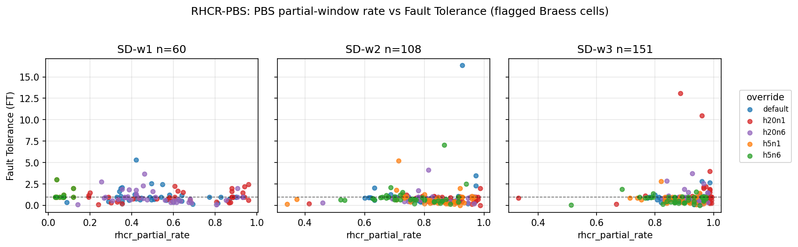

# Aisle-Width Proof — Falsification of the PBS saturation hypothesis

**Question:** the paper's RQ2 surfaces a paradoxical FT > 1 regime under RHCR-PBS at envelope-saturating density. The obvious explanation is that PBS's node-budget saturates and forces a fallback to a simpler planner, which happens to be more robust. Does this hypothesis hold?

**Answer:** no. The pooled correlation between PBS fallback rate and FT is **r = −0.029, p = 0.51, n = 518**. PBS saturation does not cause the paradox. The actual mechanism remains open for journal-grade follow-up.

## Per-cell correlation: PBS partial-rate ↔ FT

For each flagged cell we ablate the planning horizon `h` and node-limit `m` across five corners and measure the Pearson correlation between the resulting partial-solution rate and FT.

| Cell | n | r | p |
|---|---|---|---|
| SD-w1, n=60 | 141 | −0.104 | 0.218 |
| SD-w2, n=108 | 191 | +0.049 | 0.504 |
| SD-w3, n=151 | 186 | +0.063 | 0.394 |
| **Pooled** | **518** | **−0.029** | **0.506** |

None of the three per-cell correlations are significant. The pooled correlation is essentially zero.

## What the ablation also shows

FT drifts across (horizon h, node-limit m) corners in a way that is inconsistent with saturation. If PBS were saturating and falling back to a simpler planner, raising m or h should reduce the fallback rate and pull FT back below one. The opposite happens in several cells (e.g., SD-w3 n=151 default corner: FT = 0.85 with partial-rate 0.91, but corner h20n1 has FT = 1.58 with partial-rate 0.93). The fallback rate is high in both, yet FT swings by almost a full unit.

## Methods

Three flagged cells from the RQ2 sweep (SD-w1 n=60, SD-w2 n=108, SD-w3 n=151) are re-run with RHCR-PBS under five (h, m) overrides each: default, h20n1, h20n6, h5n1, h5n6. We log the per-tick PBS partial-solution rate alongside FT. Per-cell Pearson r is computed across the per-seed (FT, partial_rate) pairs, then pooled across all three cells.

## Raw data

- [`data/`](data/) — per-cell `runs` and `summary` CSVs for each of the three flagged cells.
- [`figures/proof_stats.json`](figures/proof_stats.json) — per-cell and pooled correlation numbers used in the table above.
