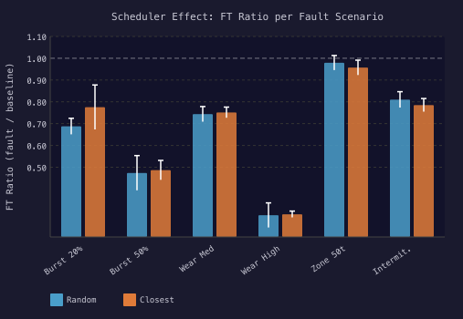

# Scheduler Effect

**Question:** does the task scheduler (closest-first vs random pickup) change fault resilience?

**Answer:** closest-first lifts mean FT slightly (0.673 vs 0.662 across all six fault scenarios at SD-w1, n=40). One of six scenarios shows a statistically significant difference under BH-FDR correction. The shift is small and uneven, which is why this analysis is supplementary, not in the paper body.

## Mean Fault Tolerance per scheduler × scenario

90 paired runs per cell (3 solvers × 30 seeds). p-values are BH-FDR corrected across the six scenarios.

| Scenario | Random FT | Closest FT | Δ | adj. p | Cliff's δ |
|---|---|---|---|---|---|
| burst_20pct | 0.687 [0.65, 0.72] | 0.775 [0.67, 0.88] | +0.088 | 0.100 | 0.169 |
| burst_50pct | 0.474 [0.39, 0.55] | 0.487 [0.44, 0.53] | +0.013 | 0.067 | 0.197 |
| wear_medium | 0.744 [0.71, 0.78] | 0.751 [0.73, 0.78] | +0.007 | 0.103 | 0.157 |
| **wear_high** | **0.280 [0.22, 0.34]** | **0.284 [0.27, 0.30]** | +0.004 | **<0.001** | **0.449** |
| zone_50t | 0.979 [0.95, 1.01] | 0.957 [0.92, 0.99] | -0.022 | 0.396 | -0.084 |
| intermittent | 0.810 [0.77, 0.85] | 0.785 [0.75, 0.82] | -0.025 | 0.626 | 0.042 |

Bold row = significant after BH-FDR correction. Brackets are 95% Student-t confidence intervals.

The only significant difference is on wear_high, and the FT delta there is +0.004 — statistically detectable but operationally tiny. The Cliff's δ of 0.449 (medium-to-large effect) tells us the seed-level distributions shift, but the means barely move.

## Methods

For each (scheduler, scenario) cell we compute mean FT across all (solver, seed) pairs, 95% Student-t CI using Welch's standard error, and a paired Welch's t-test between schedulers at fixed (solver, scenario). p-values are corrected with Benjamini–Hochberg across the six scenarios. Effect size is reported as Cliff's δ with the negligible/small/medium/large thresholds from the paper.

## Why this is supplementary, not in the paper body

A complete scheduler-fault interaction study has to explain how the task pool composition under closest-first interacts with congestion, and how that congestion couples back into cascade behaviour. That story is a paper of its own. The data is here for readers who care about scheduler choice, but the framing is honest: this is a partial analysis, not a contribution claim.

## Raw data

- [`scheduler_effect_runs.csv`](scheduler_effect_runs.csv) — every paired run (3 solvers × 6 scenarios × 2 schedulers × 30 seeds).
- [`scheduler_effect_summary.csv`](scheduler_effect_summary.csv) — aggregated stats per cell.
- [`figures/scheduler_effect_metrics.csv`](figures/scheduler_effect_metrics.csv) — the same numbers as the table above in CSV form.
- [`figures/scheduler_effect_table.tex`](figures/scheduler_effect_table.tex) — LaTeX-formatted version for direct paper insertion.
