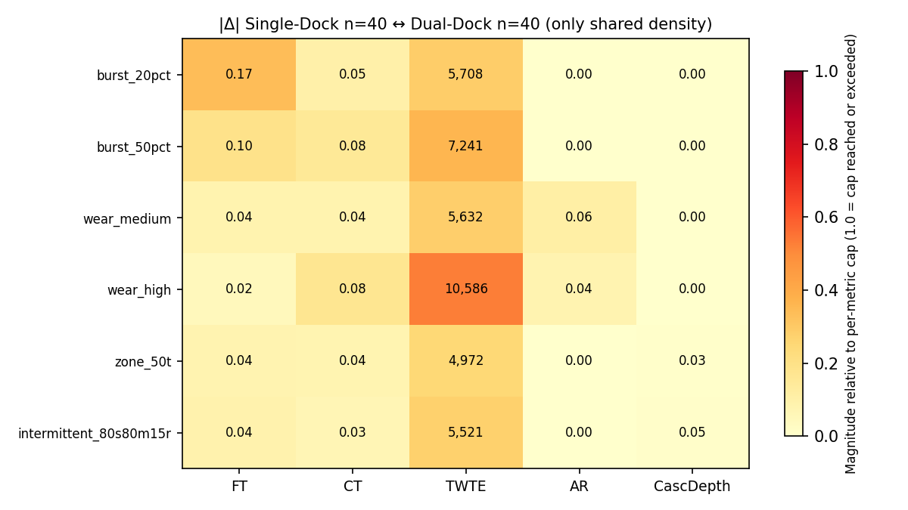
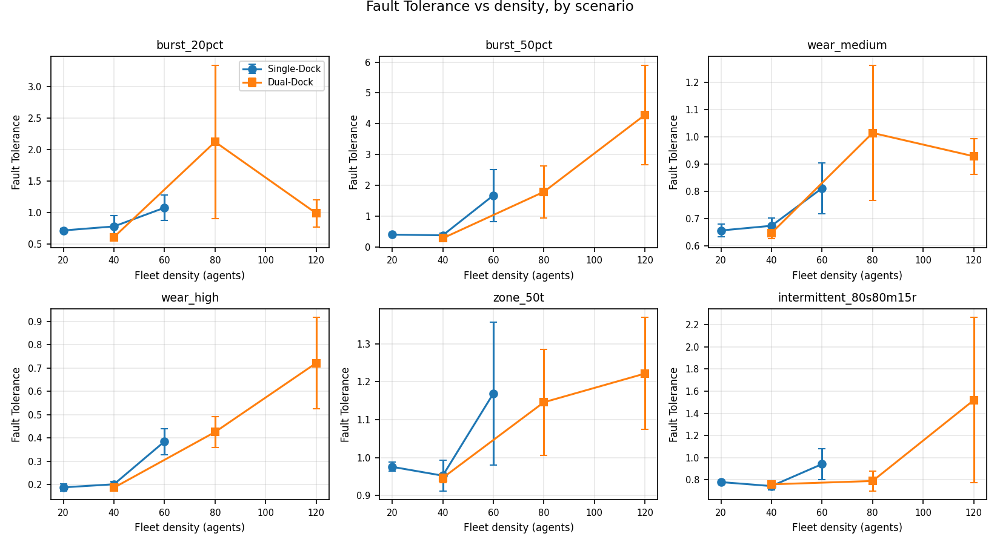
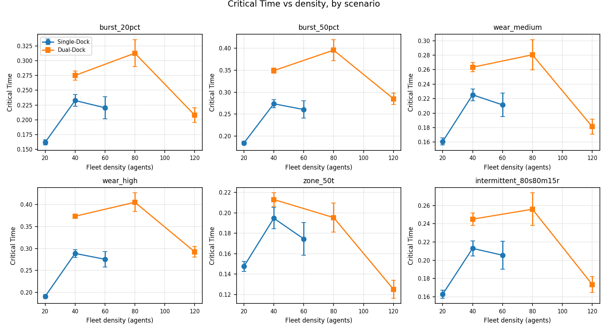
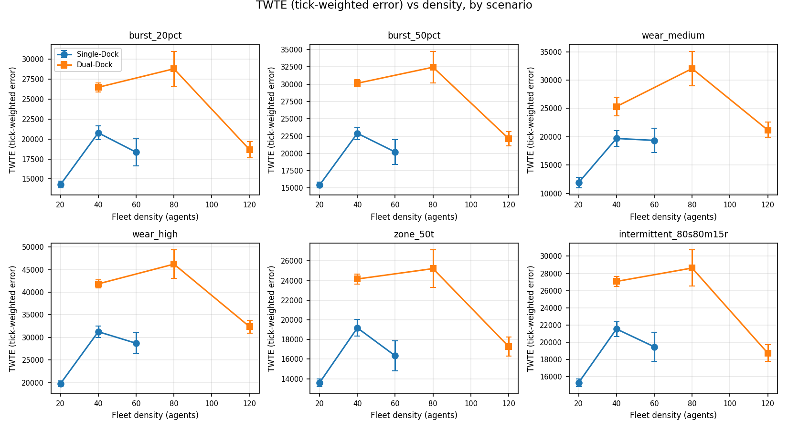
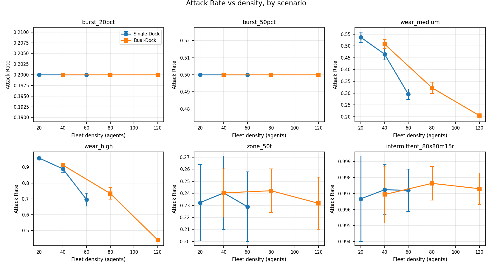
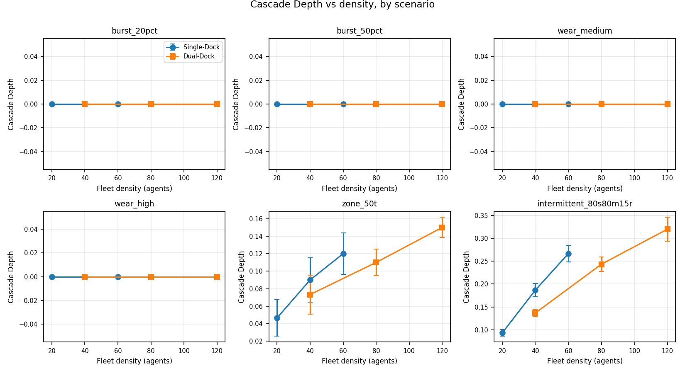

# Topology and Density Sensitivity

**Question:** does the warehouse map matter more or less than the fleet size?

**Answer (split into two honest parts):**

1. At the only shared density (n=40), switching warehouse map shifts mean Fault Tolerance by 0.07. Layout is a real but modest lever once you hold density fixed.
2. Within each topology, density is a strong lever. The trajectories below show the shape of that lever per scenario.

We do not claim a numerical ratio between layout effect and density effect because the data does not support it cleanly. Single-Dock densities (20, 40, 60) step by +20 agents at a time while Dual-Dock densities (40, 80, 120) step by +40. Any cross-topology comparison of "density step magnitude" would conflate the density effect with the step size choice. Cross-topology comparison at matched absolute density only works at n=40.

## Cross-topology delta at n=40

How far each metric moves when you switch from Single-Dock to Dual-Dock at fixed fleet size.

Colour intensity is scaled against a fixed per-metric cap so the visual signal reflects absolute magnitude, not where each value falls inside its own column. A cell at the cap saturates red. A cell well below the cap reads pale. Cells that exceed the cap are marked with `*` to flag that the colour is clipped. Caps: FT 0.5, CT 0.5, TWTE 20,000, AR 0.5, Cascade Depth 5. Cascade Depth never flips solver ranking between the two maps. TWTE flips most often.

## Metric vs density, by scenario

One figure per metric. Inside each figure, six small plots, one per fault scenario. Each small plot shows the metric on the y-axis and fleet density on the x-axis. Blue line is Single-Dock, orange line is Dual-Dock. Error bars are 95% confidence half-widths across the three solvers and 30 seeds.

<table>
<tr>
<td width="50%"></td>
<td width="50%"></td>
</tr>
<tr>
<td width="50%"></td>
<td width="50%"></td>
</tr>
<tr>
<td width="50%"></td>
<td width="50%" valign="top">

**What to look for**

- **FT**: drops sharply on the wear scenarios as density rises. Burst is flatter.
- **CT**: climbs with density on the burst and wear scenarios. Zone-outage and intermittent stay near zero.
- **TWTE**: grows roughly linearly with density on most scenarios.
- **AR**: ramps fast on wear_high because the cascade reaches more agents in a packed fleet.
- **Cascade Depth**: barely moves with density across all scenarios.

The blue (Single-Dock) and orange (Dual-Dock) lines are close at n=40 in every plot. They separate as you move away from the shared density.

</td>
</tr>
</table>

## Summary numbers

Mean absolute change per step. Cell values are mean |Δ| for the metric.

| Where | FT | CT | TWTE | AR | Cascade Depth |
|---|---|---|---|---|---|
| Cross-topology at n=40 | 0.069 | 0.054 | 6,610 | 0.016 | 0.013 |
| Single-Dock density step | 0.236 | 0.061 | 7,175 | 0.044 | 0.022 |
| Dual-Dock density step | 0.797 | 0.104 | 13,156 | 0.068 | 0.027 |

## Raw data

- [`warehouse_single_dock_summary.csv`](warehouse_single_dock_summary.csv) — Single-Dock summary at n=20, 40, 60.
- [`warehouse_dual_dock_summary.csv`](warehouse_dual_dock_summary.csv) — Dual-Dock summary at n=40, 80, 120.
- [`figures/topology_sensitivity.json`](figures/topology_sensitivity.json) — every per-cell number used in the figures above.
